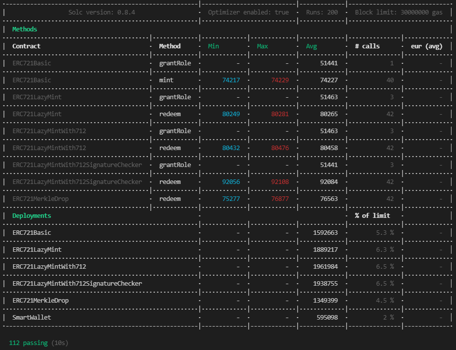

# NFTAirdropDemo

This repo is a demo for deploying ERC721 tokens utilising Merkle trees. This method is compared with other deployment strategies.
The Merkle-airdrop would allow for the deployer to have comparitively cheaper deployment, and would allow an airdrop startegy in which the minting of a token is paid for by the token recipient; further reducing deployer's cost.

Merkle-proofs would also provide an additional element of verifcation as to who exactly can receive the airdrop and guarantee no new tokens could be minted after this airdrop.

Docs are created using hardhat-docgen.

## Cost examples
 

</a>

 
Made with hardhat-gas-reporter

## Made with
- Solidity
- Hardat

### This repo is inspired by;
- Openzeppelin's workshop; [nft-merkle-drop](https://github.com/OpenZeppelin/workshops/tree/master/06-nft-merkle-drop)
